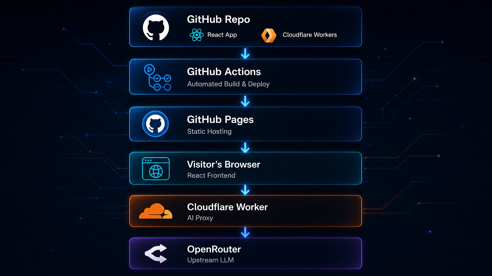
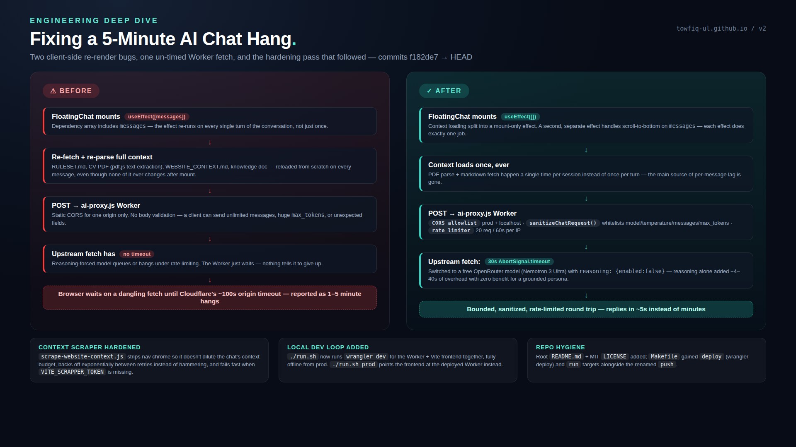

# From a Leaked API Key in the Browser to a Hardened Edge Proxy: Building the AI Assistant on My Portfolio

*How a floating "ask me anything about Towfiqul" chat widget went from a demo-grade integration — API key sitting in
plaintext in the shipped JS bundle — to a Cloudflare Worker that validates, clamps, rate-limits, times out, and
benchmarks its own model choice.*

---

## What the assistant actually does

My portfolio ([towfiq-ul.github.io](https://towfiq-ul.github.io)) has a floating chat widget (`FloatingChat` in
`v2/src/components/ai/ai-chat.tsx`) that answers questions about my background — recruiters and fellow developers ask it
things like "what did he do at bKash" or "can I get his email," and it answers *only* from a grounded context, not from
whatever the base model happens to know about the world.

The behavioral contract lives in `public/RULESET.md`, not in the component code — it defines the persona ("Towfiqul's AI
Assistant," strictly professional, never abusive, de-escalates rudeness), a hard grounding rule ("If a question isn't
answered in the provided context, say so — never hallucinate projects or years of experience"), a domain glossary (bK =
bKash, MFS = Mobile Financial Services), and a contact-intent protocol: if a user asks to reach me, the assistant offers
Email or WhatsApp, and only after they pick one does it emit a machine-readable token — `[ACTION:EMAIL_ME]` or
`[ACTION:WHATSAPP_ME]` — at the end of its reply. The React component watches for those tokens, strips them from the
rendered text, and shows a **Yes, thanks! / No, thanks!** confirmation before actually firing off a mailto link or
WhatsApp deep link. The LLM proposes the action; the UI is what actually executes it, and only on explicit user
confirmation.

Small but deliberate touches: replies render as Markdown, there's a live online/offline dot that pings
`google.com/favicon.ico` every 30 seconds to detect real connectivity (not just `navigator.onLine`, which lies on
captive portals), and a typing indicator covers the round-trip latency.

## High-level system diagram

Before the message-by-message detail, here's the whole system at rest — where each piece is deployed, what holds the
credential, and how the pieces connect:

```
 ┌────────────────────────────────────────────────────────────┐
 │                  GitHub Repo (source of truth)             │
 │   v2/src (React app)  ·  v2/workers/ai-proxy.js            │
 │   v2/public (RULESET.md, CV PDF, WEBSITE_CONTEXT.md, ...)  │
 └───────────────────────────┬────────────────────────────────┘
                             │ push to master
                             ▼
 ┌───────────────────────────────────────────────────────────────┐
 │             GitHub Actions  (.github/workflows/deploy.yml)    │
 │   npm run build — injects VITE_* values from                  │
 │   GitHub Actions Secrets (proxy URL, EmailJS keys, etc.)      │
 └───────────────────────────┬───────────────────────────────────┘
                             │ uploads build/ artifact
                             ▼
 ┌────────────────────────────────────────────────────────────┐
 │              GitHub Pages  (towfiq-ul.github.io)           │
 │   Serves the compiled static bundle + public/*.md, *.pdf   │
 │   as plain static assets. No server-side code runs here.   │
 └───────────────────────────┬────────────────────────────────┘
                             │ HTML / JS / CSS / context files
                             ▼
 ┌───────────────────────────────────────────────────────────────────┐
 │                     Visitor's Browser                             │
 │  FloatingChat (React component)                                   │
 │   • fetches RULESET.md / CV PDF / WEBSITE_CONTEXT.md /            │
 │     knowledge.md directly from the static host above              │
 │   • holds ONLY `VITE_AI_PROXY_URL` — no API key, ever             │
 │   • Cloudflare Web Analytics beacon also loads here (site-wide)   │
 └───────────────────────────┬───────────────────────────────────────┘
                             │ POST { model, messages, ... }
                             │ CORS: Origin must be in allowlist
                             ▼
 ┌────────────────────────────────────────────────────────────────────────────┐
 │             Cloudflare Worker — ai-proxy.js                                │
 │      (deployed independently via `wrangler deploy`,                        │
 │       lives in v2/workers/, NOT part of the GitHub Pages build)            │
 │                                                                            │
 │  Secrets (set via `wrangler secret put`, encrypted, never in               │
 │  source or the client bundle):                                             │
 │     • AI_API_KEY, AI_BASE_URL                                              │
 │  Bindings:                                                                 │
 │     • RATE_LIMITER  — native Cloudflare rate limiting (20/60s/IP)          │
 │  Observability:                                                            │
 │     • logs + traces, head_sampling_rate = 1, persisted                     │
 │                                                                            │
 │  validate → sanitize → clamp → forward, 30s upstream timeout               │
 └───────────────────────────┬────────────────────────────────────────────────┘
                             │ POST /chat/completions
                             │ Authorization: Bearer AI_API_KEY
                             ▼
 ┌──────────────────────────────────────────────────────────┐
 │                  Upstream LLM — OpenRouter               │
 └──────────────────────────────────────────────────────────┘


 Separate, offline pipeline — feeds content INTO the repo above,
 not part of the live request path:

 ┌───────────────────┐     ┌───────────────────────────┐     ┌────────────────────────────┐
 │  npm run sync     │───▶ │ scrape-website-context.js │───▶ │ v2/public/                 │
 │  (run manually    │     │ hits an external markdown-│     │ WEBSITE_CONTEXT.md         │
 │  by the author)   │     │ scraping service, strips  │     │ (committed to the repo,    │
 └───────────────────┘     │ nav chrome, retries with  │     │ shipped on the next build) │
                           │ exponential backoff       │     └────────────────────────────┘
                           └───────────────────────────┘
```

Two things this view makes obvious that the per-message flow doesn't: the Worker is deployed **completely separately**
from the static site (its own `wrangler deploy`, its own secrets, its own lifecycle) — GitHub Pages has no idea it
exists — and the credential boundary is a single box in the whole diagram. Everything to the left of the Worker (repo,
CI, static host, browser) can be fully public with zero risk; everything to the right of it (the Worker's secrets and
its call to OpenRouter) is the only part that ever needs to stay private.



## Request flow: from keystroke to rendered reply

This is the current (post-hardening) path a single message takes, end to end — every branch below is a real early-return
in `ai-proxy.js`, not a simplification:

**Context load — once, at mount, never again per message:**

```
  Component mounts
        │
        ▼
  Promise.all() fetches in parallel:
    • RULESET.md
    • CV PDF        (parsed client-side via pdf.js)
    • WEBSITE_CONTEXT.md
    • knowledge.md
        │
        ▼
  Concatenated into ONE system prompt (~20-25k chars)
        │
        ▼
  Stored in React state — reused for every message,
  never re-fetched or re-parsed again
```

**Per-message request — every step below is a real early-return in `ai-proxy.js`:**

```
  Visitor types message, hits Send
        │
        ▼
  FloatingChat POSTs to Cloudflare Worker:
    { model, temperature, max_tokens,
      messages: [system, ...history, user] }
        │
        ▼
  ┌────────────────────────────────┐
  │ Method === POST ?              ├──No──▶ 405 Method Not Allowed
  └────────────┬───────────────────┘
               │ Yes
               ▼
  ┌────────────────────────────────┐
  │ Origin in allowlist?           ├──No──▶ 403 Forbidden
  │ (prod domain + localhost:3000) │
  └────────────┬───────────────────┘
               │ Yes
               ▼
  ┌────────────────────────────────┐
  │ AI_API_KEY / AI_BASE_URL       ├──No──▶ 500 Secrets not configured
  │ secrets present?               │
  └────────────┬───────────────────┘
               │ Yes
               ▼
  ┌────────────────────────────────┐
  │ Under rate limit?              ├──No──▶ 429 Too Many Requests
  │ (20 requests / 60s per IP)     │
  └────────────┬───────────────────┘
               │ Yes
               ▼
  ┌────────────────────────────────┐
  │ Content-Length under cap?      ├──No──▶ 413 Payload Too Large
  └────────────┬───────────────────┘
               │ Yes
               ▼
  ┌────────────────────────────────┐
  │ sanitizeChatRequest():         │
  │ whitelist fields · clamp       ├──Invalid──▶ 400 Bad Request
  │ lengths/temperature/max_tokens │
  │ · force reasoning: false       │
  └────────────┬───────────────────┘
               │ Valid
               ▼
  ┌────────────────────────────────┐
  │ Forward to upstream LLM        │
  │ Authorization: Bearer          ├──Timeout/Error──▶ 502 Proxy error
  │ AI_API_KEY (30s AbortSignal)   │   (upstream never sees the client)
  └────────────┬───────────────────┘
               │ Responds in time
               ▼
  200: completion JSON + CORS headers
        │
        ▼
  FloatingChat parses choices[0].message.content
        │
        ▼
  Contains [ACTION:EMAIL_ME] or [ACTION:WHATSAPP_ME] token?
        │                                  │
       Yes                                 No
        │                                  │
        ▼                                  ▼
  Strip token, store pendingAction,   Render Markdown reply
  show Yes/No confirmation
        │
        ▼
  User confirms → opens mailto: link / WhatsApp deep link
```

Two things worth noticing: the context-loading block runs exactly once, at mount — that's the fix for Bug 1 below, not a
simplification — and `AI_API_KEY` never appears anywhere in the per-message flow except inside the Worker's own outbound
call to the upstream LLM. The browser only ever holds `VITE_AI_PROXY_URL`, a plain endpoint with no credential in it.

## How the assistant is fed its knowledge

On mount, one effect fires exactly once and pulls four sources in parallel:

```tsx
const [rulesetContext, documentPdfContext, websiteContext, documentMdContext] = await Promise.all([
    ParsedMdContext("/RULESET.md"),
    ParsePdfContext("/Towfiqul_Islam_AI.pdf"),
    ParsedMdContext("/WEBSITE_CONTEXT.md"),
    ParsedMdContext("/Towfiqul_Islam.md")
]);
```

Each source does a different job:

- **`RULESET.md`** — the persona and behavior rules described above. This is the *how to answer*, not the *what to
  answer*.
- **A CV PDF, parsed live in the browser** via `pdf.js` (`parse-pdf-context.tsx` walks every page, pulls
  `getTextContent()`, and concatenates the raw text) — no server-side preprocessing, no OCR pipeline, just client-side
  text extraction on every session.
- **`WEBSITE_CONTEXT.md`** — a scrape of the live site itself, so the assistant can answer questions grounded in
  whatever's actually published, not a stale snapshot baked in at some earlier date.
- **`Towfiqul_Islam.md`** — a hand-maintained knowledge doc for anything that doesn't naturally live on the CV or the
  site.

All four get concatenated into one clearly-delimited system message (`SYSTEM RULES:` / `Document Context:` /
`Website Context:` / `AI Knowledge:`) and sent with every turn. Fixing the "run once, not on every message" boundary
here turned out to be half of a nasty performance bug — more on that below.

The website scrape itself is a separate pipeline: `npm run sync` runs `scripts/scrape-website-context.js`, which calls
an external markdown-scraping service with headers like `X-Return-Format: markdown` and `X-Remove-Selector: nav` (
stripping the site's repeated nav chrome so it doesn't burn context budget on boilerplate), retries short/failed
responses with exponential backoff instead of hammering immediately, and fails fast — before making any network call —
if the scraper token is missing. Output is written straight to `public/WEBSITE_CONTEXT.md`, which is what the frontend
fetches at chat-mount time.

## Version 1: the naive integration (and the leaked key)

The very first commit that added this feature (`f4e9914`, "add ai assistant") called the OpenAI SDK directly from the
React component:

```tsx
const client = new OpenAI({
    apiKey: import.meta.env.VITE_OPEN_AI_API_KEY,
    baseURL: import.meta.env.VITE_OPEN_AI_BASE_URL,
    dangerouslyAllowBrowser: true
});
```

That `dangerouslyAllowBrowser: true` flag exists specifically because the SDK *refuses* to run in a browser by default —
it's a guardrail against exactly this mistake, and it was explicitly overridden. The problem isn't subtle: Vite inlines
every `VITE_`-prefixed environment variable into the static JS bundle at build time. That bundle ships to GitHub Pages
and is served to every single visitor. The API key wasn't hidden behind any server — it was sitting in plaintext inside
a public `.js` file, retrievable by anyone who opened dev tools, ran `view-source`, or just grepped the deployed bundle.
Beyond that, every chat request left the browser with a live `Authorization: Bearer <key>` header visible in the Network
tab. This wasn't "security through obscurity that could theoretically be broken" — the credential was simply public the
moment the site deployed.

(A nice organic detail: the very first version's hardcoded fallback model string had a version-suffix typo that got
quietly corrected in the very next revision — a good reminder this evolved iteratively, not as a pre-planned
architecture.)

## Version 2: introducing the Cloudflare Worker proxy

Commit `f976994` ("add cloudflare api proxy") removed the `openai` SDK from the client entirely and replaced the direct
call with a plain `fetch()` against a new environment variable, `VITE_AI_PROXY_URL`:

```tsx
const res = await fetch(import.meta.env.VITE_AI_PROXY_URL, {
    method: "POST",
    headers: {"Content-Type": "application/json"},
    body: JSON.stringify({model, temperature, messages}),
});
```

`VITE_AI_PROXY_URL` is safe to bake into the client bundle — it's just an endpoint, not a credential. The actual model
call now happens inside a Cloudflare Worker (`v2/workers/ai-proxy.js`):

```js
const upstream = await fetch(`${env.AI_BASE_URL}/chat/completions`, {
    method: "POST",
    headers: {"Authorization": `Bearer ${env.AI_API_KEY}`, "Content-Type": "application/json"},
    body: JSON.stringify(body),
});
```

`env.AI_API_KEY` and `env.AI_BASE_URL` are **Worker Secrets** — set via `wrangler secret put`, encrypted at rest by
Cloudflare, injected into the Worker's runtime environment, and never committed to source or bundled into anything a
browser downloads. This is the single most important architectural change in the whole project: the browser stops being
a party that can possess the credential at all.

At this stage the Worker was still a thin, trusting proxy, though — it checked that the request method was `POST` and
that the `Origin` header matched the production domain, then forwarded the client's JSON body to the upstream API
completely untouched. That gap is exactly what the next round of hardening closed.

## Version 3: a mystery multi-minute hang, and hardening the Worker

Users started reporting replies that occasionally took **one to five minutes** to come back — no error, no crash, just
silence. Chasing an intermittent, non-crashing latency bug is miserable because there's no stack trace pointing at the
culprit; it took looking at both ends of the request to find two independent bugs stacked on top of each other (commit
`919e674`).

**Bug 1 — the context reload loop.** The `useEffect` that loaded the four grounding sources had `messages` (the chat
history) in its dependency array. That meant *every single turn* re-triggered two markdown fetches and a full `pdf.js`
text extraction of the CV — none of which ever changes after mount. Fix: split into a mount-only effect for context
loading and a separate effect that only handles scroll-to-bottom.

**Bug 2 — an un-timed fetch across a trust boundary.** The Worker's call to the upstream model had no timeout. When the
provider queued or rate-limited a request instead of rejecting it outright, the Worker's `fetch()` just sat there — and
the browser sat waiting on it — until Cloudflare's own ~100-second origin timeout eventually killed the connection.
That's most of the reported 1–5 minute hangs, right there. Fix:

```js
signal: AbortSignal.timeout(30_000)
```

Now the Worker fails fast and predictably at 30 seconds instead of silently riding out someone else's timeout window.

While already inside `ai-proxy.js`, several other gaps were obvious enough to fix in the same pass:

- **No request validation.** A `sanitizeChatRequest()` function now whitelists exactly the fields the app needs (
  `model`, `temperature`, `messages`, `max_tokens`), rejects unknown message roles, and clamps every numeric/length
  value — `MAX_MESSAGES = 60`, `MAX_MESSAGE_CHARS = 4_000`, `MAX_TOTAL_CHARS` (later raised to 60,000), temperature
  capped at 2, `max_tokens` capped at 1024. Nothing stopped a client from previously sending an unbounded conversation
  or an inflated `max_tokens` — both cost real money against the API key.
- **A header is not a credential.** The Worker only checked `Origin` against the production domain. That's fine for real
  browser CORS behavior, but `Origin` is just client-supplied text — trivially spoofed by a script that isn't a browser
  at all. The comment left in the code is blunt about it: *"Origin is client-supplied and trivially spoofed by
  non-browser callers, so it's not real auth."*
- **No rate limiting**, which is what actually bounds abuse regardless of what `Origin` claims. Cloudflare's native
  rate-limiting binding closed that gap in a few lines of config:

  ```toml
  [[ratelimits]]
  name = "RATE_LIMITER"
  namespace_id = "1001"
  simple = { limit = 20, period = 60 }
  ```

  The Worker checks `if (env.RATE_LIMITER)` before using it, so it **fails open** — skips limiting rather than
  breaking — if the binding is ever absent. A deliberate tradeoff for a low-stakes personal-site proxy, documented
  directly in the config file.
- **Reasoning overhead with zero benefit.** The upstream model was reasoning by default before answering every message —
  pure latency tax for a bot that just answers grounded questions about a CV. Explicitly disabling it (
  `reasoning: { enabled: false }`) took one measured model from **6.1s down to 2.3s** on an empty prompt.

The Origin check was later upgraded again (`b5ed542`) from a single hardcoded string to a proper allowlist — production
domain *and* `localhost:3000` — with `Vary: Origin` response headers, specifically because the stricter origin check had
made local development against the deployed Worker impossible (`./run.sh` now runs `wrangler dev` locally, reading
secrets from a git-ignored `.dev.vars`, so there's a fully offline dev loop with zero dependency on the deployed
Worker).

## Version 4: model choice becomes an actual measurement, not a guess

Commit `f36707e` benchmarked two free-tier models available through the upstream model marketplace head-to-head, on a
realistic ~5,000-token production-sized prompt: the incumbent model against a newer candidate. The candidate won on both
axes — **4.9s vs 5.5s**, while generating **3.4x more content** in that time — so it became the new default. The same
reasoning caveat applied, more severely: on a trivial prompt, reasoning took the new model from **0.6s to 41.5s**.
That's not a rounding error; disabling reasoning is doing the majority of the latency work in this whole system.

The Worker also grew a dedicated ceiling for the system prompt specifically — `MAX_SYSTEM_CHARS = 40_000` — separate
from the per-turn message cap, because the grounding context (RULESET + PDF + website scrape + knowledge doc) runs **~
20–25k characters in production**, measured directly rather than guessed. It's fixed app content, not user input, so it
earns a much higher budget than any individual conversation turn.

## Why a Cloudflare Worker specifically, not "some backend"

- **No server to run.** The Worker deploys from the same repo via `wrangler`, alongside a static GitHub Pages site with
  no origin server of its own to keep alive.
- **Secrets that actually stay secret.** `wrangler secret put` stores the key encrypted at Cloudflare's edge and injects
  it only into the Worker's runtime `env` — never in source control, never in a client bundle. This is the actual fix
  for the leaked key, not a relocation of the same problem.
- **A rate limiter as a one-line config block**, not a Redis instance to provision and operate.
- **Built-in observability** — `wrangler.toml` turns on logs and traces with `head_sampling_rate = 1` and
  `persist = true`, which is almost certainly how the 6.1s/2.3s and 41.5s/0.6s numbers above were actually measured, not
  guessed.
- **CORS enforcement at the edge**, before a request ever reaches app logic.
- **Free-tier friendly**, matching the zero-budget nature of a personal portfolio while still using production-grade
  patterns instead of skipping them because "it's just a portfolio."

As a bonus in the same spirit, `3d6e18f` added Cloudflare Web Analytics — a cookie-less visitor-tracking beacon — so the
entire operational layer around this static React app (secrets, rate limiting, timeouts, analytics) now sits on
Cloudflare rather than scattered across ad-hoc services.

## The performance story, start to finish

| Stage                                                            | Symptom / Measurement                                                                                                                                                                         |
|------------------------------------------------------------------|-----------------------------------------------------------------------------------------------------------------------------------------------------------------------------------------------|
| v1–v2 (direct SDK / naive proxy)                                 | Occasional **1–5 minute** hangs, reported as a bug, no clear cause                                                                                                                            |
| Root cause found                                                 | `useEffect([messages])` re-parsing the CV PDF + re-fetching markdown context on every turn, stacked with a Worker `fetch()` with **no timeout**, riding Cloudflare's own ~100s origin timeout |
| Fix: mount-only context load + `AbortSignal.timeout(30_000)`     | Worker now fails predictably at 30s instead of an unbounded hang                                                                                                                              |
| Fix: `reasoning: { enabled: false }`                             | **6.1s → 2.3s** on one model (early measurement); **41.5s → 0.6s** on a trivial prompt (later measurement, more severe)                                                                       |
| Fix: benchmarked model swap (previous default → measured winner) | **5.5s → 4.9s**, plus **3.4x more content** generated in that time                                                                                                                            |

Two individually minor bugs — a wrong dependency array and a missing timeout — compounded into a hang dramatic enough to
get reported. Neither one alone explains multiple minutes; together, hitting in sequence, they do.

## Before and after, with dates and the goal each change actually achieved

| Change                              | Implemented | Before                                                                                                                                                           | After                                                                                                                                                  | Goal achieved                                                                                                                                 |
|-------------------------------------|-------------|------------------------------------------------------------------------------------------------------------------------------------------------------------------|--------------------------------------------------------------------------------------------------------------------------------------------------------|-----------------------------------------------------------------------------------------------------------------------------------------------|
| **Credential moved off the client** | 2026-06-06  | LLM API key lived in a `VITE_`-prefixed env var, inlined into the public JS bundle by the direct SDK call (`dangerouslyAllowBrowser: true`)                      | Browser talks only to a Cloudflare Worker URL; the real key is a Worker Secret injected server-side                                                    | Credential can no longer be read from dev tools, view-source, or the deployed bundle                                                          |
| **Latency + Worker hardening**      | 2026-07-13  | Context reloaded (incl. full PDF re-parse) on every chat turn; Worker `fetch()` had no timeout; requests forwarded untouched; no rate limit                      | Context loads once at mount; 30s `AbortSignal` timeout; `sanitizeChatRequest()` validates/clamps every field; per-IP rate limiting; reasoning disabled | Reported **1–5 minute** hangs eliminated; replies land in a few seconds; abuse surface (unbounded messages/tokens, unlimited requests) closed |
| **Model benchmarking**              | 2026-07-13  | Upstream model picked without measurement; reasoning left on by default                                                                                          | Two candidate models benchmarked on a realistic prompt; reasoning explicitly forced off in the request payload                                         | **5.5s → 4.9s** latency, **3.4x more content**, and a trivial-prompt worst case cut from **41.5s to 0.6s**                                    |
| **Local dev workflow**              | 2026-07-13  | Origin allowlist was a single hardcoded production string — any `localhost` request got a flat 403, so the hardened Worker couldn't be developed against locally | Origin allowlist is a `Set` (prod + `localhost:3000`) with `Vary: Origin`; `./run.sh` runs `wrangler dev` locally against a git-ignored `.dev.vars`    | Full offline dev loop restored with zero dependency on the deployed Worker                                                                    |
| **Visitor analytics**               | 2026-07-13  | No visibility into real visitor traffic on the deployed site                                                                                                     | Cookie-less Cloudflare Web Analytics beacon added site-wide; a stray duplicate script tag (double-loading the app) removed in the same pass            | Traffic visibility gained with no cookie-consent burden, plus a real (unrelated) bug fixed for free                                           |

## Pros and cons of this architecture

**Pros**

- **Real credential isolation, not obfuscation.** The API key sits in exactly one place — a Worker Secret — and the
  system diagram above shows that as a single box; everything to its left can be fully public with zero risk.
- **Zero servers to operate.** Both the static site and the proxy deploy from the same repo (GitHub Pages +
  `wrangler deploy`); there's no origin server, container, or VM to patch or keep alive.
- **Abuse controls are config, not infrastructure.** Rate limiting is a four-line TOML block, not a Redis instance to
  provision, monitor, and pay for separately.
- **Observability comes for free.** Worker logs and traces are what actually produced the latency numbers in this post —
  no third-party APM was bolted on.
- **Cheap enough for a zero-budget project.** Free-tier Worker requests in front of a free-tier model still get proper
  validation, timeouts, and rate limiting — hardening wasn't traded away for cost.
- **Grounding data is fully auditable.** The four context sources are plain static files anyone with repo access can
  read and diff — no hidden vector store or opaque fine-tune to trust blindly.

**Cons**

- **Client-side context loading has a real cost.** Every visitor's browser re-fetches and re-parses the CV PDF via
  `pdf.js` on its own first mount — fine for a low-traffic portfolio, but it's client CPU/bandwidth spent repeatedly on
  work that's identical for every visitor and could instead be pre-processed once at build time.
- **Fail-open rate limiting is a deliberate trade, not a free one.** If the `RATE_LIMITER` binding is ever misconfigured
  or missing, abuse protection silently disappears rather than the Worker refusing to serve — the right call for a
  low-stakes personal proxy, the wrong one for anything handling real cost or real user data.
- **Free-tier upstream models carry no latency/uptime SLA.** The entire multi-minute-hang story exists because the
  provider could queue or change reasoning behavior without warning — a paid, contracted model tier would remove that
  variable, at a cost.
- **`Origin` plus per-IP rate limiting is a soft ceiling, not hard auth.** A determined caller behind a rotating pool of
  IPs (or simply patient enough to stay under 20 req/min per IP) can still reach the upstream model through the Worker
  indefinitely; there's no API key, session, or account behind the chat widget at all.
- **Secrets management is manual.** `wrangler secret put` is a one-time CLI action with no rotation schedule or audit
  trail beyond Cloudflare's own dashboard — fine at this scale, a gap at team scale.
- **The system prompt is public by construction.** `RULESET.md`, the CV, and the knowledge doc are static assets served
  to anyone — this exact pattern can't be reused as-is for a business with genuinely confidential grounding data without
  adding an auth layer in front of the Worker.
- **No conversation history or QA loop.** Nothing persists past the browser tab beyond Cloudflare's own request logs —
  there's no transcript store to review for hallucinations, abuse, or product feedback unless one is added deliberately.

## Where this same pattern fits other business models

Nothing about this architecture — grounded context, an edge proxy holding the only credential, request sanitization, and
per-caller rate limiting — is specific to a personal portfolio. Two examples of the same pieces solving a different
problem:

- **E-commerce product-support widget.** Swap `RULESET.md` for a policy doc ("never quote a price, stock level, or
  return window not present in the fed catalog") and swap `WEBSITE_CONTEXT.md` for a live product/FAQ export. The
  `[ACTION:EMAIL_ME]` / `[ACTION:WHATSAPP_ME]` token pattern generalizes directly into `[ACTION:ADD_TO_CART]` or
  `[ACTION:START_RETURN]` — the LLM proposes, the UI still executes only on confirmation. The one thing that would need
  real re-tuning: real customer volume means the 20 req/60s-per-IP rate limit and the `MAX_SYSTEM_CHARS` budget (sized
  here for one CV) both need re-sizing for a catalog that's or magnitudes larger and an audience that isn't just
  recruiters trickling in.
- **Subscription SaaS onboarding assistant, usage-based billing model.** The same `sanitizeChatRequest()` clamp on
  `max_tokens` and message count stops being just an abuse guard and becomes actual unit-economics control — capping the
  worst-case cost of every request is exactly what protects margin on a metered API bill. Rate limiting evolves from "
  per-IP abuse prevention" into "per-account entitlement": free-tier accounts get a handful of messages a day, paid
  tiers get materially more, enforced with the same binding, keyed on an account ID pulled from a session instead of
  `CF-Connecting-IP`. The Worker-holds-the-only-credential shape doesn't change at all — only what it's guarding against
  does, shifting from "don't let a stranger burn my API key" to "don't let a free-tier user consume a paid-tier's worth
  of margin."

The specific grounding files and action tokens are this project's implementation detail; the shape around them — never
let the browser hold the credential, never trust the client's request body, always cap the worst case, always measure
instead of guessing — is the reusable part.

## The arc from beginner to expert

1. **Make the demo work.** Call the LLM SDK straight from the browser, key in an env var. Fine for a local hackathon
   prototype; fatal the moment it's deployed publicly, because `VITE_`-prefixed vars ship in the bundle by design.
2. **Move the secret behind a server.** A Cloudflare Worker holding the real key as an encrypted secret is the single
   change that matters most — most tutorials stop exactly here and call it done.
3. **Assume the client is hostile.** The Worker's public URL is *itself* now public the moment it ships in a bundle —
   anyone can script against it directly, bypassing the browser and the `Origin` header entirely. Validate the shape of
   every request, clamp every number, rate-limit by IP, and put a timeout on every call that crosses a trust boundary
   you don't control.
4. **Measure, don't assume.** Pick the model by benchmarking real prompts against real numbers — latency, output volume,
   and whether "reasoning" is even doing useful work for this task — not by whichever name sounds most capable in its
   marketing.

That's the whole journey: from a plaintext key sitting in a public JS file, to a hardened, observed, rate-limited edge
proxy in front of a benchmarked model — on a personal portfolio site, with a Cloudflare free tier as the only
infrastructure.

---

---

*Repo: [towfiq-ul.github.io](https://github.com/towfiq-ul/towfiq-ul.github.io) — key commits: `f4e9914` (initial
integration), `f976994` (Cloudflare proxy introduced), `919e674` (latency fix + Worker hardening), `f36707e` (model
benchmarking), `b5ed542` (local dev workflow), `3d6e18f` (Cloudflare Web Analytics).*

---
Medium Post: [From a Leaked API Key in the Browser to a Hardened Edge Proxy: Building the AI Assistant on My Portfolio](https://medium.com/@towfiq106/from-a-leaked-api-key-in-the-browser-to-a-hardened-edge-proxy-building-the-ai-assistant-on-my-3684973ecd3d?sharedUserId=towfiq106)